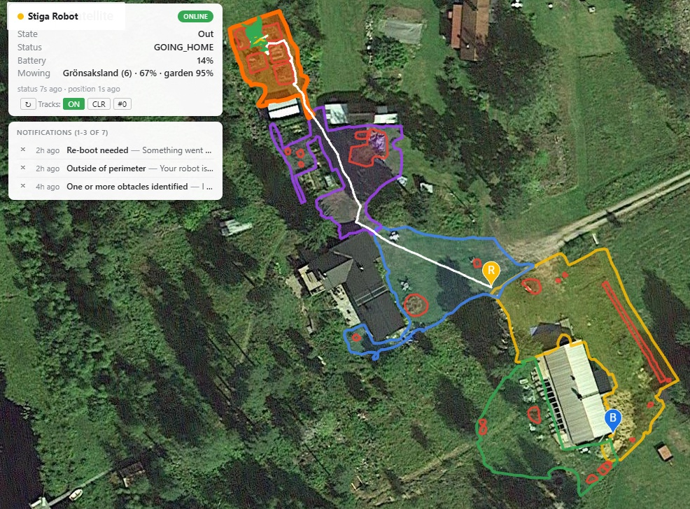

# stiga-api

> An unofficial, reverse-engineered API for the **Stiga A-series robot mowers**, developed and tested against a Stiga A1500. Not officially provided nor supported by Stiga. Mostly to MONITOR and ANALYSE, rather than CONTROL.

<table>
<tr>
<td width="50%"><video src="assets/web-recording-20260609.mp4" controls width="100%"></video></td>
<td width="50%"><video src="assets/cli-recording-20260609.mp4" controls width="100%"></video></td>
</tr>
</table>

---

## Start

1. Install NodeJS (e.g. as per [nodesource](https://nodesource.com/products/distributions)).
2. Clone this repo (`git clone https://github.com/matthewgream/stiga-api`).
3. Run `npm install` in `stiga-api` to get the `package.json` module dependencies.
4. Edit `stiga-config.js` to specify your username and password, plus your station's lat/lon.
5. Run `tools/stiga-command.js check` for Cloud and MQTT connectivity checks.
6. Exercise `tools/stiga-command.js` as you please for version, status, actions, etc.
7. Utilise `tools/stiga-monitor.js --monitor` for console-based real-time status interface.
8. Read the updates/details below, if you please — note that newer updates may invalidate details in older.

```text
root@workshop:/opt/stiga-api# tools/stiga-command.js check
Installation check:
  [OK]   credentials: username=user.name@gmail.com
  [OK]   authentication: token obtained
  [OK]   server reachable: https://connectivity-production.stiga.com
  [OK]   garage load: devices=1, bases=1, packs=1
  [OK]   device found: mac=D0:EF:76:64:32:BA
  [OK]   device metadata: name='Stiga Stuga' fw=0.0.3.151.0.0.3.143.0.0.3.68 broker=broker2
  [OK]   base found: mac=FC:E8:C0:72:EC:62
  [OK]   mqtt connect: TLS+auth OK
  [OK]   robot subscribe: 4 topics
  [OK]   robot version: 0.0.3.151/0.0.3.143/0.0.3.68/EG912UGLAAR03A09M08_01.200.01/1.32
  [OK]   robot status: op=BLOCKED
  [OK]   base subscribe: 4 topics
  [OK]   base status: op=STANDBY
```

```
root@workshop:/opt/stiga-api# tools/stiga-command.js
Usage: stiga-command [options] <command> [params...]

Options:
  --robot              Select/Add robot as target
  --base               Select/Add base station as target
  --both               Select both robot and base station as targets (default)
  --debug              Enable debug output (on stderr)
  --level <lvl>        Output level: quiet (errors only), normal (default), verbose (extra diagnostics on stderr)
  --format <fmt>       Output format: none (suppress), text (default), json (one JSON object per line)
  --watch [secs]       Watch and show events: request status every "secs" (default 5) if idle; 0 = passive (no polling)
  --passive            Alias for --watch 0 (passive listen, no polling)
  --username <u>       Override username credential from stiga-config.js
  --password <p>       Override password credentials from stiga-config.js
  --mqtt-broker <id>   Override MQTT broker suffix (e.g. broker, broker1, broker2)

Configuration (resolved in order, first match wins):
  1. --username/--password command-line flags (credentials only)
  2. $STIGA_CONFIG environment variable (path to a config file)
  3. stiga-config.<hostname>.js  (this host: stiga-config.workshop.js)
  4. stiga-config.js

Commands (| separates aliases, any unique prefix also matches):
  version                        Get firmware/hardware version (robot, base)
  status [types...]              Get operation/battery/mowing/location/network status (robot, base)
  schedule [subcommand]          Display/enable/disable/insert/remove mowing schedule (robot)
  settings                       Display device settings (robot, base)
  start                          Start mowing (robot)
  stop                           Stop the robot (robot)
  go-home|home                   Send the robot home to dock (robot)
  calibrate-blades|blades        Calibrate the cutting blades (robot)
  info|describe                  Dump all known information for the selected target(s) (robot, base)
  check                          Step-by-step installation/connectivity health check (robot, base)
  perimeters                     Display garden zones and obstacles from the cloud (robot)
  user                           Display the cloud account profile (robot, base)
  notifications [qualifier...]   Display device notifications/events from the cloud (robot, base)

For command-specific help:
  stiga-command <command> help

Examples:
  stiga-command --robot version
  stiga-command --robot status
  stiga-command --robot schedule
  stiga-command --robot settings
  stiga-command --robot start
  stiga-command --robot stop
  stiga-command --robot go-home
  stiga-command --robot calibrate-blades
  stiga-command --robot info
  stiga-command check
  stiga-command perimeters
  stiga-command user
  stiga-command notifications
  stiga-command --robot --watch
  stiga-command --robot --watch 0 --debug
  stiga-command --robot --watch 0 --format json --level quiet | jq .
  stiga-command --robot status --format json --level quiet | jq .
```

---

## Usage

Once installed, the `tools/stiga-command.js` gives operational insights and control. Try it.

I recommend installing `tools/stiga-monitor.js` as a systemd service according to `tools/stiga-monitor.service`, which provides a background running CLI console 
(use `tools/stiga-monitor.js --connect` to connect to it as a client, then disconnect when not needed) and the Web frontend (port 3001 by default), plus 
message `capture` for later analysis (using `tools\stiga-analyse.js`), maybe after at least 4 weeks of operation. By default, the Web front end retains data in
memory, but can persist (`--persist`) if you'd prefer to retain it across restarts (it defaults to `/dev/shm`, so you will need to adjust to a local file
system). `capture` defaults to a local file system.

With `analyse`, you can evaluate (a) mobile and gnss/rtk connectivity heatmaps across the garden; (b) battery charge and consumption profiles; and
(c) garden completion analysis. More details below.

For `webstatus` as run by `tools/stiga-monitor.js`, you might want to parameritise the URL, including enabling commands and configuring the map position and
zoom level, and bookmark it.

---

## Open issues

Do not know how to obtain/update: (a) zone settings, (b) temporary obstacles, (c) zone links, (d) zone management commands, (e) obstacle parameters.

The following is a set of rolling updates, each new entry may update/obsolete something older. Needs to be cleaned and tidied.

---

## Update (26 May 2026)

A lot of updates over the last two weeks. None of these are breaking/changes (I hope), but are all enhancements onto last years functionality, namely (1) supporting additional commands in stiga-command.js and in the API when needed (e.g. perimeters); (b) building out a "webstatus" in stiga-monitor.js, which is great for desktop side monitoring; (c) tidying up error messages, terminology (e.g. gnss/rtk, etc) and "polish"; (d) supporting a config file with reference, authentication, api keys and more (removing hard coded gnss reference points for example); (e) add scripts directory with add hoc scripts for probing/accessing the API in ways that are not yet API supported or understood.

It's probably at a reasonably stable point that there will not be any more major changes for some weeks. We un-hiberneted the mower and this is the large noise that happens!

Next, I want to revisit the reverse engineering to understand zone settings and other messages and functionality. We'll see when we get up to that.

## Update (23 May 2026)

Significantly expanded `--webstatus`; you can run it like this:

```bash
tools/stiga-monitor.js --webstatus=3001/password --monitor --persist --persist-days=28
```

Which will (a) cache and persist status and position information for up to 28 days; (b) render a webserver on port 3001 with http authentication `password` to show the status of the robot, including its recent positions and status.

Then, on the client side, you can use arguments like this:

```
https://workshop.local:3001/?boxStatus=rt&mapControls=off&tracks=on&tracksClr=3&statusBatterySparkline=off&mapPosition=-38cm,-4.60m,19&commands=on
```

This (a) moves the status box to the right-top; (b) turns off the map controls (zoom, etc) so just use mouse; (c) shows the robots tracks by default; (d) clears the tracks after three zones (so you see up to three zones of history); (e) turns off the battery sparkline, (f) shows the map at an offset of 38cm/4.6m from the computed centre of the garden [check the browser console for help with this], (g) turns on the command box ("start", "stop", "home"). This is a kind of kiosk mode.



## Update (22 May 2026)

Corrected the display of RTK offset in status and position messages.

Implemented a `--webstatus` option to stiga-monitor.js, which will render a map and robot status/position, with also breadcrumb tail of activity, defaulting to port 3001. This gives you a web based way to monitor the robot. For this, you need a [Google Maps API key](https://developers.google.com/maps/documentation/javascript/get-api-key) which you can then place in your stiga-config.js.

Implemented `user`, `notifications`, and `perimeter` commands in stiga-command.js, to show all of this data, including qualifiers for notifications (unread, recent, etc). The perimeters are rendered on the webstatus map, as they are also in the mobile app. Note this shows both zones and obstacles, but not temporary go-away areas at the moment.

## Update (20 May 2026)

Added further commands to `stiga-command.js`: all the basic ones plus ability to read settings.

Moved the authentication to a file called `stiga-config.js` that now also includes the default reference point of the base station. The configuration will be read as either the file specified by `STIGA_CONFIG` environment variable, or `stiga-config.$(HOSTNAME).js` [so if your hostname is `workshop`: then `stiga-config.workshop.js`], or `stiga-config.js`, or the legacy `stiga_user_and_pass.js` (with a deprecation warning).

Support different levels of output including JSON to help automations, e.g. a bug in the product keeps sending the robot to a disabled zone, so you can use a script like this:

```bash
root@workshop:/opt/stiga-api# cat scripts/stiga-zone-guard.sh
#!/usr/bin/env bash
set -u
CMD="tools/stiga-command.js --robot"
while true; do
    JSON="$(${CMD} status --format json --level quiet 2>/dev/null)"
    echo "${JSON}"
    ZONE="$(echo "${JSON}" | jq -r '.value.mowing.zone // empty')"
    if [ -z "${ZONE}" ]; then
        echo "mower zone is unknown: OK, no action"
    elif [ "${ZONE}" = "1" ] || [ "${ZONE}" = "2" ]; then
        echo "mower zone is ${ZONE}: OK, no action"
    else
        echo "mower zone is ${ZONE}: stopping and sending home"
        ${CMD} stop
        sleep 30
        ${CMD} go-home
        exit 0
    fi
    sleep 30
done
```

```text
root@workshop:/opt/stiga-api# tools/stiga-command.js
Usage: stiga-command [options] <command> [params...]

Options:
  --robot          Select/Add robot as target
  --base           Select/Add base station as target
  --both           Select both robot and base station as targets (default)
  --debug          Enable debug output (on stderr)
  --level <lvl>    Output level: quiet (errors only), normal (default), verbose (extra diagnostics on stderr)
  --format <fmt>   Output format: none (suppress), text (default), json (one JSON object per line)
  --watch [secs]   Watch and show events: request status every "secs" (default 5) if idle; 0 = passive (no polling)
  --passive        Alias for --watch 0 (passive listen, no polling)
  --username <u>   Override username credential from stiga-config.js
  --password <p>   Override password credentials from stiga-config.js

Configuration (resolved in order, first match wins):
  1. --username/--password command-line flags (credentials only)
  2. $STIGA_CONFIG environment variable (path to a config file)
  3. stiga-config.<hostname>.js  (this host: stiga-config.workshop.js)
  4. stiga-config.js

Commands (| separates aliases, any unique prefix also matches):
  version                   Get firmware/hardware version (robot, base)
  status                    Get operation/battery/mowing/location/network status (robot, base)
  schedule                  Display/enable/disable/insert/remove mowing schedule (robot)
  settings                  Display device settings (robot, base)
  start                     Start mowing (robot)
  stop                      Stop the robot (robot)
  go-home|home              Send the robot home to dock (robot)
  calibrate-blades|blades   Calibrate the cutting blades (robot)
  info|describe             Dump all known information for the selected target(s) (robot, base)
  check                     Step-by-step installation/connectivity health check (robot, base)

For command-specific help:
  stiga-command <command> help
```

## Update (13 May 2026)

To use this repo, you should clone it locally, follow the instructions below to configure authentication, and then smoke test with `tools/stiga-command.js check`. If this succeeds, you can progress. If this does not succeed, send me any diagnostics and we can work on resolving them.

`tools/stiga-monitor.js` — to see a curses based "monitor" of the mower, and for diagnostics this can "capture" status information to a local database. You may need to collect data over a number of weeks, so use the background option to leave it running, and the connect option to connect to that background instance. There is also a systemd service file (`tools/stiga-monitor.service`) if you'd prefer to have it automatically run in the background (`make service_install` / `make service_watch` / `make service_restart`).


`tools/stiga-analyser.js` — to read the capture database and generate information on battery-charge, battery-consumption, garden-completion and position-heatmaps (to show mobile and GPS signal strengths). See the example results in the `assets` directory.

```text
Complete Charging Sessions (< 20% to > 80%):
Start Time               Duration    From %  To %    Change    Rate           Capacity
2025-07-01T12:06:00.024Z 68.5 min    15%     81%     +66%      14.45% / 15min 5000 mAh
2025-07-01T19:52:44.373Z 70.0 min    18%     83%     +65%      13.93% / 15min 5000 mAh
2025-07-02T13:01:40.331Z 87.6 min    0%      82%     +82%      14.04% / 15min 5000 mAh
...
Estimated charging times (based on average rate):
  20% to 80%: 64 minutes
  0% to 100%: 107 minutes
```

Full example outputs: [analysis-battery-charge.txt](assets/analysis-battery-charge.txt) · [analysis-battery-consumption.txt](assets/analysis-battery-consumption.txt) · [analysis-garden-completion.txt](assets/analysis-garden-completion.txt).

| Combined heatmap | Satellites | RSSI |
| --- | --- | --- |
|  |  |  |

`tools/stiga-position-viewer.js` — to read the capture database and run a local webserver (port 3000 by default) to view the positions overlaid on Google Maps.

`tools/stiga-exporter.js` — to read the capture database and translate it into CSV or Google Sheets format for analysis and diagnostics.

`tools/stiga-command.js` — to directly interact with the reference station and mower. It supports a number of information, configuration and operational commands which are fully explained by the help and examples.

`tools/stiga-tools.bash` — to load autocomplete information into bash for use with the tools.

`api` is where the JS based API lives.

The remaining directories are more for development: `assets` with various text and images (e.g. output of the analyser), `reverse` with reverse engineering tools (Android APK deconstruction and interception), and `tests` to exercise the API.

The `Makefile` has simple targets for `export`, `display` and `monitor`; plus the systemd service targets; and the development prettier and lint targets.

Note on the reverse engineering: the tools deconstruct the Android APK for the Cloud/MQTT certificates, and modify the APK to proxy through the running monitor in `intercept` mode, so that all communication both ways between the Stiga Cloud/MQTT and the Stiga App can be intercepted, logged and analysed.

## Update (8 July 2025)

This is an API for the Stiga A series Robot Mowers, as developed and tested with a Stiga A1500. The API is entirely reverse engineered and therefore not officially provided nor supported by Stiga. It is still under active development, having just reached a viable first release, with further work planned. You should be aware that the API is unsupported and not extensively tested across models and circumstances. If you choose to use the API, you should expect to have degree of technical competence. The API operates on Linux based systems with NodeJS and some third-party (NPM installed) modules. With minimal changes, it would likely work on any system supported by NodeJS and the third-party modules.

### Architecture

The Robot Mowers have a Cloud infrastructure with a HTTP interface accessed with an OAuth token generated using your Stiga username/password.

The Cloud infrastructure supplies a set of data, such as User (account) details, Notifications, Garden Perimeters and a "Garage" which contains the primary device information: the Robot itself, its associated Reference Station and any communication "Packs".

With the Robot and Base station MAC addresses, provided by the "Garage", it is then possible to use the OAuth token to connect to an MQTT broker for direct access to the Robot and Base, to both control it, and monitor it. This MQTT connection will also yield traffic between the Robot and Base themselves (as the Robot communicates with it to enable/disable differential GNSS publishing) and between these and any other devices (such as mobile phone applications).

Primarily, the direct MQTT access enables (1) requesting/receiving version, status and setting information; (2) changing setting.

The Robot also communicates directly with the Cloud for synchronisation of the Garden perimeters and details.

### Current status

The functionality for direct access to the Robot and Base is pretty substantial.

On top of the API are some tools that allow

(1) to monitor the robot/base (capture, listen, intercept and monitor). This was developed to aid reverse engineering, but serves as way to real-time monitor the robot/base in a text based console (the "monitor" option), and to "capture" the messages for later analysis: in particular the status messages.

(2) to analyse the robot/base (battery charge, battery consumption, garden completion, and position heatmap) to understand the charging, consumption and operating behaviours (to help optimise the scheduling choices) and also to understand the non-optimal performance (e.g. the amount of time the robot is spending stuck or in error states). The position heatmaps help understand the location (GNSS) and communication (mobile network) signal strengths as to where the weak and issue spots are. You can see some of these analysis and heatmaps in the assets folder.

(3) to command the robot/base (get status/version, get settings / update settings, command to start / stop, etc).

There is in addition to the core API, a set of tests, and some reverse engineering tools remaining.

Currently, there is still much work to do on (3), in particular the commands are still being built out and tested, and the Cloud behaviour is still quite unexplored.

However, in the current state, it gives a basic set of tools to monitor, analyse and control the Robot/Base. Thus far, all of this reverse engineering has occurred without physical access to the Robot/Base (it is at our summer house), and substantially more development will occur by the latter part of 2025.

### Authentication

Currently, you need to create a `stiga_user_and_pass.js` in the main directory with the following contents. This is not an elegant solution and will be improved. In addition, some of the tools require credentials (for exporting database to Google Sheets) and keys (for generating heatmaps).

```js
module.exports = {
    username: 'your_email@gmail.com',
    // eslint-disable-next-line sonarjs/no-hardcoded-passwords
    password: 'your_password'
}
```

### Components

The API is accessed through by requiring `api/StigAPI`: there should be sufficient details in the tools and tests to illustrate how this works.

```
StigaAPI.js
StigaAPIUtilitiesProtobuf.js, StigaAPIUtilitiesFormat.js
StigaAPIElements.js, StigaAPIMessages.js
StigaAPIAuthentication.js, StigaAPICertificates.js
StigaAPIConnectionServer.js, StigaAPIConnectionMQTT.js, StigaAPIConnectionDevice.js
StigaAPIBase.js, StigaAPIBaseConnector.js
StigaAPIDevice.js, StigaAPIDeviceConnector.js
StigaAPIUser.js, StigaAPINotifications.js, StigaAPIGarage.js, StigaAPIPerimeters.js
StigaAPIComponent.js, StigaAPIFramework.js
```

### Directories

The assets directory stores generated assets from the tools (images, text, etc).

The data directory holes the capture database and other diagnostic style data (e.g. listen and intercept logs).
